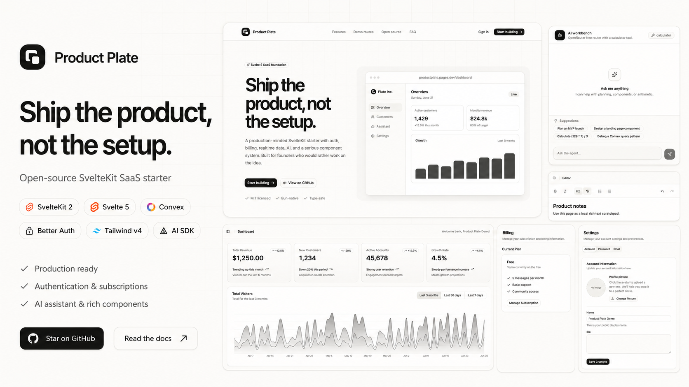

<p align="center">
  
</p>

<h1 align="center">Product Plate</h1>

<p align="center">
  <strong>Ship the product, not the setup.</strong>
</p>

<p align="center">
  Open-source SvelteKit SaaS starter with auth, billing, realtime data, AI patterns, tests, deployment, and a practical AI kickstart prompt.
</p>

<p align="center">
  <a href="https://productplate.pages.dev/auth/demo">Live demo</a>
  ·
  <a href="https://youtu.be/REPLACE_ME">Demo video</a>
  ·
  <a href="./START_HERE.md">Kickstart prompt</a>
  ·
  <a href="https://productplate.pages.dev/components">Components</a>
  ·
  <a href="./LICENSE">MIT</a>
</p>

<p align="center">
  
  
  
  
  
  
  
  
</p>

## What is this?

Product Plate is a SvelteKit starter for people who want to build a real product without rebuilding the same base every time.

It gives you a working SaaS foundation: auth, protected app routes, onboarding, profiles, settings, billing, admin users, realtime Convex data, file uploads, AI chat patterns, tests, PWA setup, and Cloudflare deployment.

The useful difference: it also ships with [`START_HERE.md`](./START_HERE.md), a kickstart prompt for your AI coding agent. The prompt asks what you are building, recommends what to keep, removes demo-only surfaces, activates one stack, renames the app, and updates the docs so the repo becomes your product instead of staying a generic template.

## Try it

- **Live demo:** [productplate.pages.dev/auth/demo](https://productplate.pages.dev/auth/demo)
- **Demo video:** [YouTube placeholder](https://youtu.be/REPLACE_ME)
- **Demo script:** [`docs/demo-script.md`](./docs/demo-script.md)

The hosted demo creates a fresh disposable account and opens the app shell.

## What you get

- **Svelte app:** SvelteKit 2, Svelte 5, TypeScript, Tailwind CSS v4, shadcn-svelte.
- **Backend:** Convex functions, realtime queries, storage, typed APIs, server-side auth helpers.
- **Auth:** Better Auth email/password, Google OAuth wiring, reset-password screens, protected routes.
- **Billing:** Autumn billing page, product cards, checkout, billing portal hooks.
- **AI:** Vercel AI SDK route, streaming assistant UI, Markdown, suggestions, calculator tool pattern.
- **Product UI:** landing page, component gallery, dashboard, settings, profile, admin users, editor, graph, 3D demo.
- **DX:** Bun, Devenv, Vitest, Playwright, ESLint, Prettier, Svelte diagnostics, Cloudflare Pages workflow.

## The kickstart flow

Clone the repo, then give [`START_HERE.md`](./START_HERE.md) to your coding agent from the repo root.

The agent will:

1. Ask what product you are building.
2. Inspect the starter surfaces.
3. Recommend what to keep, rename, remove, or decide later.
4. Help you choose one active stack.
5. Update constants, copy, docs, routes, demo surfaces, and provider scaffolds.
6. Run the right checks and leave a handoff.

That is the intended Product Plate workflow: **template first, guided cleanup immediately after.**

## Quick start

```sh
git clone https://github.com/rodrgds/productplate.git my-product
cd my-product
```

Before installing or deploying, run the kickstart:

```txt
Open START_HERE.md, paste the prompt into your AI coding agent, and answer the product questions.
```

Then run locally:

```sh
bun install
cp .env.example .env.local
bun convex dev
bun dev
```

Open `http://localhost:5173`.

For local auth, make sure Convex knows the local app URL:

```sh
bun convex env set SITE_URL http://localhost:5173
```

### Devenv option

```sh
devenv shell
setup
devenv up
```

## Environment

Required for local development:

```env
CONVEX_DEPLOYMENT=
PUBLIC_CONVEX_URL=
PUBLIC_CONVEX_SITE_URL=
SITE_URL=http://localhost:5173
BETTER_AUTH_SECRET=
```

Optional integrations:

```env
GOOGLE_CLIENT_ID=
GOOGLE_CLIENT_SECRET=
RESEND_API_KEY=
RESET_EMAIL_FROM=
RESET_EMAIL_REPLY_TO=
OPENROUTER_API_KEY=
AUTUMN_SECRET_KEY=
```

See `.env.example` and `.env.server.example` for the full list, including inactive provider options.

## Commands

| Command             | Purpose                         |
| ------------------- | ------------------------------- |
| `bun dev`           | Start SvelteKit                 |
| `bun convex dev`    | Start Convex                    |
| `bun run check`     | Typecheck Svelte and TypeScript |
| `bun run lint`      | Run Prettier and ESLint checks  |
| `bun run test:unit` | Run Vitest                      |
| `bun run test:e2e`  | Run Playwright                  |
| `bun run build`     | Build for production            |
| `bun run verify`    | Run lint, check, tests, build   |

## Project map

```text
src/routes/                 SvelteKit routes and API handlers
src/routes/(app)/           Authenticated product routes
src/lib/components/ui/      shadcn-svelte primitives
src/lib/components/ai/      AI chat and tool components
src/lib/components/landing/ Reusable landing sections
src/lib/components/mist/    Product Plate marketing sections
src/convex/                 Convex schema, auth, billing, functions
_template_options/          Inactive provider/database scaffolds
docs/                       Integration docs and demo script
```

## Deployment

The default production path is Convex plus Cloudflare Pages.

```sh
bun convex deploy
bun run build
```

Cloudflare Pages settings:

```text
Build command: bun run build
Build output: .svelte-kit/cloudflare
Node.js: 22
```

The included GitHub Actions workflow can deploy to Cloudflare Pages after you configure the required secrets and variables.

## Roadmap

Product Plate `v0.1` is intentionally small enough to understand and fork. Planned follow-ups:

- project creation CLI
- Drizzle/Postgres/SQLite option
- Polar support
- more landing examples
- stronger docs around production hardening

## Credits

Product Plate adapts MIT-licensed component and marketing-block ideas from the Svelte ecosystem, including shadcn-svelte, Svelte Shadcn Blocks, Motion for Svelte, beUI, Magic UI, Aceternity UI, and AI Elements.

## License

MIT. Use it for personal, commercial, closed-source, or open-source projects.
