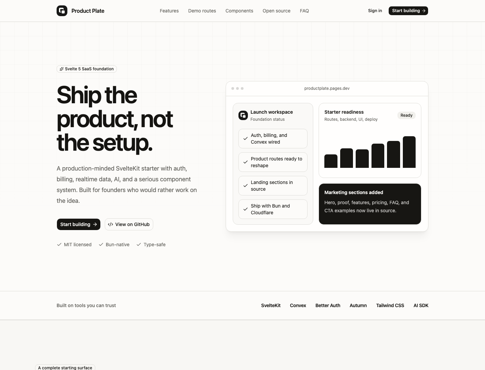
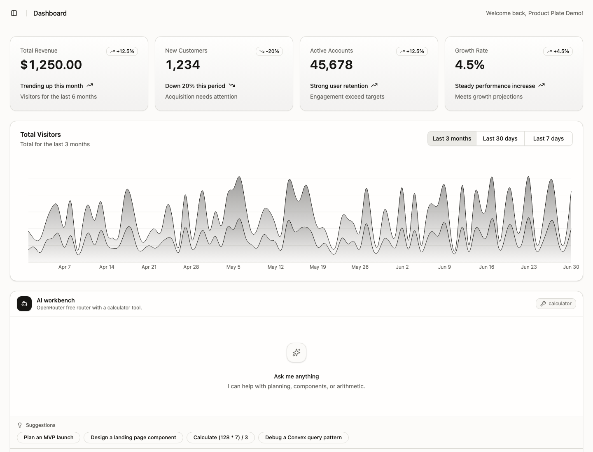
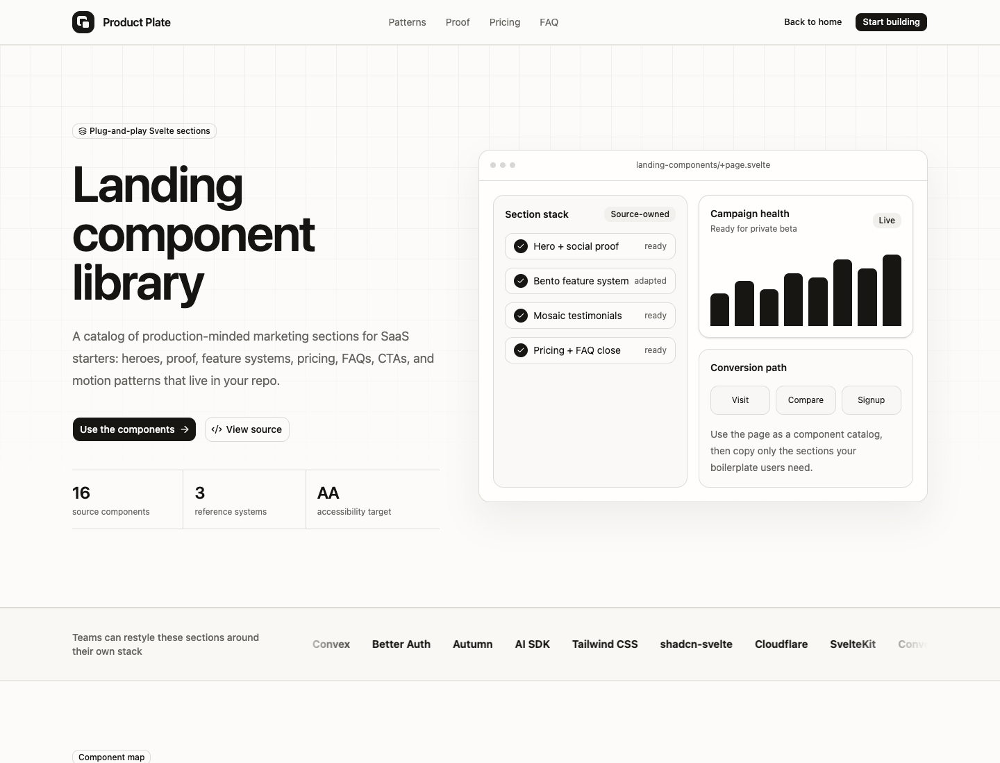
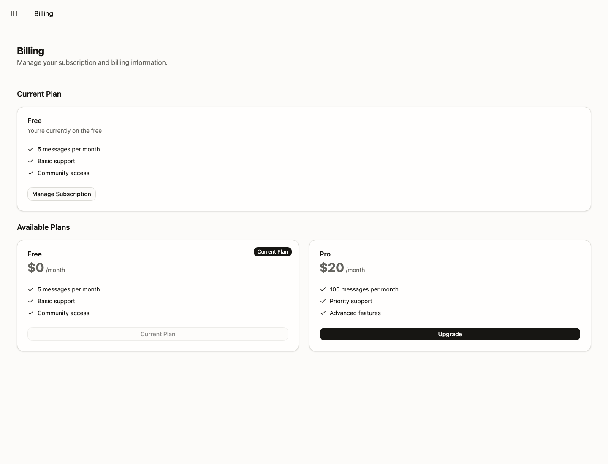
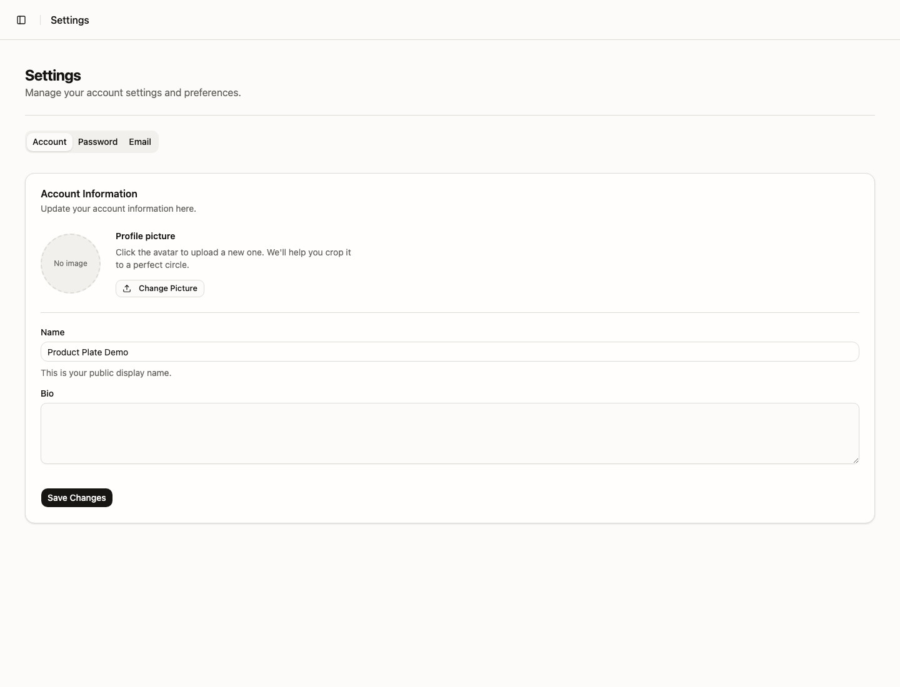
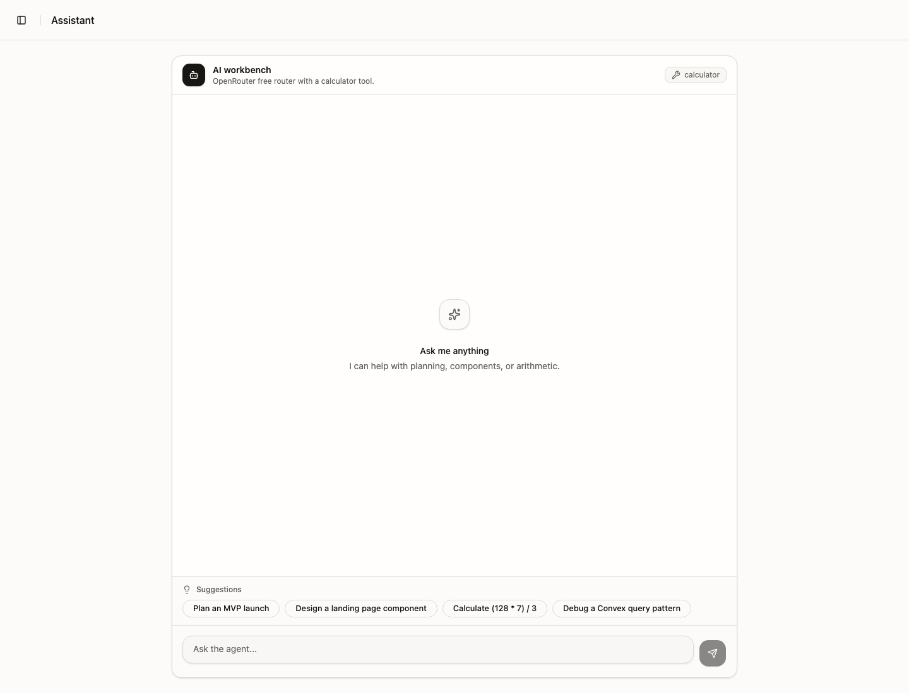
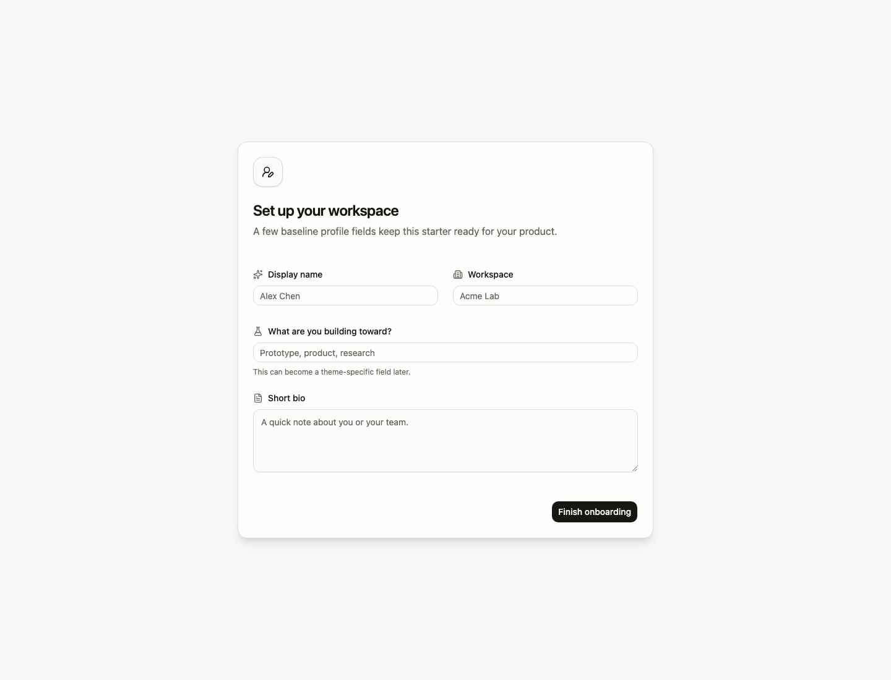
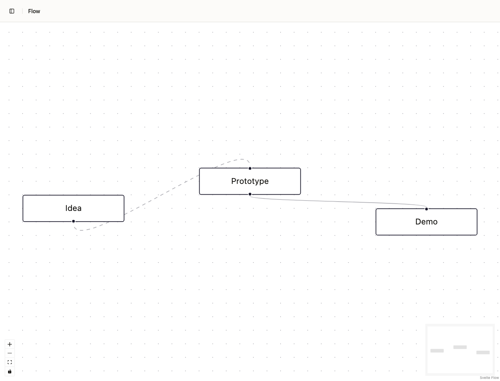

<p align="center">
  
</p>

<h1 align="center">Product Plate</h1>

<p align="center">
  <strong>Ship the product, not the setup.</strong>
</p>

<p align="center">
  An open-source SvelteKit SaaS starter with auth, billing, realtime data, AI patterns, and a polished product UI.
</p>

<p align="center">
  <a href="https://productplate.pages.dev/auth/demo">Live demo</a>
  ·
  <a href="https://productplate.pages.dev/components">Landing components</a>
  ·
  <a href="https://github.com/rodrgds/productplate">GitHub</a>
  ·
  <a href="./LICENSE">MIT License</a>
</p>

<p align="center">
  
  
  
  
  
  
  
  
  
  
</p>

## What is Product Plate?

Product Plate is a production-minded SaaS starter for founders, indie hackers, and SvelteKit developers who do not want to rebuild the same foundation every time.

It gives you the boring but necessary parts of a real SaaS app: authentication, billing, realtime backend functions, protected app routes, onboarding, profiles, settings, dashboard UI, AI assistant patterns, editor and workflow demos, tests, PWA setup, and deployment wiring.

It is not a locked-down framework. It is ordinary SvelteKit and Convex application code, designed to be forked, changed, deleted, and shaped into your own product.

## Why use it?

- **Open source and MIT licensed** - use it for personal, commercial, closed-source, or open-source projects.
- **Modern Svelte stack** - SvelteKit 2, Svelte 5, TypeScript, Tailwind CSS v4, and shadcn-svelte.
- **Real SaaS surfaces included** - landing page, landing component gallery, auth, onboarding, dashboard, assistant, billing, settings, profiles, admin users, editor, graph, and 3D demo routes.
- **Backend already wired** - Convex functions, realtime data, storage, typed APIs, auth integration, and billing hooks.
- **AI-ready** - Vercel AI SDK streaming chat and tool patterns are included instead of left as an exercise.
- **Good developer experience** - Bun, Devenv, Vitest, Playwright, linting, typechecking, PWA setup, and Cloudflare Pages CI/deployment.

## Screenshots

<p align="center">
  
</p>

<p align="center">
  
</p>

<p align="center">
  
</p>

| Billing                                                                                               | Settings                                                                                                      |
| ----------------------------------------------------------------------------------------------------- | ------------------------------------------------------------------------------------------------------------- |
|  |  |

| Assistant                                                                                                          | Editor                                                                                             |
| ------------------------------------------------------------------------------------------------------------------ | -------------------------------------------------------------------------------------------------- |
|  |  |

| Onboarding                                                                                  | Flow                                                                        |
| ------------------------------------------------------------------------------------------- | --------------------------------------------------------------------------- |
|  |  |

Try the hosted no-login demo at **[productplate.pages.dev/auth/demo](https://productplate.pages.dev/auth/demo)**. It creates a fresh disposable demo account, signs into the real app shell, and opens the dashboard.

## Included

### Core stack

- SvelteKit 2
- Svelte 5
- TypeScript
- Tailwind CSS v4
- shadcn-svelte
- Bun

### Backend and data

- Convex functions
- Realtime queries
- Typed APIs
- Convex storage
- Server-side auth helpers
- Protected app routes

### Product features

- Landing page with responsive nav, feature blocks, route previews, pricing CTA, FAQ, and footer
- Hosted disposable demo-account entrypoint at `/auth/demo`, meant to be deleted by the kickstart agent
- Better Auth email/password sign-up and sign-in
- Google OAuth provider wiring
- Forgot-password and reset-password screens
- Protected app shell with sidebar navigation and user menu
- Onboarding flow for profile and workspace setup
- Landing component gallery with reusable hero, marquee, stats, bento, beUI-style tabs, comparison, timeline, orbit, mosaic proof, pricing, FAQ, CTA, and footer sections
- Dashboard with metric cards, interactive chart, data table, and embedded AI workbench
- AI assistant route with Vercel AI SDK streaming, Markdown rendering, suggestions, and calculator tool
- Autumn billing page with current plan, product cards, checkout, and billing portal hooks
- Settings tabs for profile, password, and email changes
- Profile image upload/editor flow using Uppy, webcam, crop, Convex storage, and profile update
- Public profile route
- Admin users route with list, create, role update, ban/unban, delete, and pagination UI
- ProseKit rich text editor route
- Svelte Flow graph route
- Threlte/Three.js 3D route
- PWA manifest, icons, service worker prompt, and offline-ready reload UI

### UI and components

- shadcn-svelte primitives
- Marketing blocks adapted for Product Plate
- Plug-and-play landing components in `src/lib/components/landing`
- Source-owned bento, orbit, testimonial mosaic, pricing, FAQ, CTA, and footer patterns
- Product cards, Formsnap/superforms forms, tables, overlays, navigation, charts, editor, graph, 3D, and AI components
- Clean neutral design system that is easy to restyle

### Developer experience

- Bun-only package management
- Reproducible Devenv shell
- `devenv up` process setup for SvelteKit and Convex
- Vitest unit tests
- Playwright end-to-end tests
- ESLint, Prettier, and Svelte diagnostics
- Convex codegen and generated AI guidelines
- Cloudflare Pages deploy workflow
- GitHub Actions quality workflow
- `START_HERE.md` kickstart prompt for AI-assisted product customization
- Inactive `_template_options` scaffolds for Stripe, Polar, Creem, Autumn, Convex, and Drizzle choices

## Quick start

### Option 1: local tools

```sh
git clone https://github.com/rodrgds/productplate.git my-saas
cd my-saas
```

Before installing or deploying, run the AI kickstart:

1. Open `START_HERE.md`.
2. Paste the prompt into your AI coding agent from this repo root.
3. Answer the product and stack questions.
4. Let the agent rename the app, remove the demo account, activate one stack, delete unused scaffolds, and update docs.

Then install and start local services:

```sh
bun install
cp .env.example .env.local
```

Start Convex and SvelteKit in separate terminals:

```sh
bun convex dev
```

```sh
bun dev
```

Open **http://localhost:5173**.

For local auth, make sure the Convex dev deployment uses the same site URL as SvelteKit:

```sh
bun convex env set SITE_URL http://localhost:5173
```

### Option 2: Devenv

```sh
git clone https://github.com/rodrgds/productplate.git my-saas
cd my-saas
devenv shell
setup
devenv up
```

`setup` installs dependencies and creates `.env.local` if it does not exist. `devenv up` runs SvelteKit and Convex together.

## Environment

Copy `.env.example` to `.env.local` and fill in the services you use.

Required for local development:

```env
CONVEX_DEPLOYMENT=
PUBLIC_CONVEX_URL=
PUBLIC_CONVEX_SITE_URL=
SITE_URL=http://localhost:5173
BETTER_AUTH_SECRET=
```

Optional integrations:

```env
GOOGLE_CLIENT_ID=
GOOGLE_CLIENT_SECRET=
RESEND_API_KEY=
RESET_EMAIL_FROM=
RESET_EMAIL_REPLY_TO=
OPENROUTER_API_KEY=
AUTUMN_SECRET_KEY=
```

Inactive kickstart options are documented in `_template_options` and `docs/template-options.md`. Add only the env vars for the provider you select, such as `STRIPE_SECRET_KEY`, `POLAR_ACCESS_TOKEN`, `CREEM_API_KEY`, or `DATABASE_URL`.

See `.env.example` and `.env.server.example` for the full setup.

Server-side auth and billing code runs in Convex, so production server values such as `SITE_URL`, `BETTER_AUTH_SECRET`, OAuth secrets, email keys, and Autumn keys should also be configured with `bun convex env set`.

## Commands

| Command             | Purpose                           |
| ------------------- | --------------------------------- |
| `bun dev`           | Start SvelteKit                   |
| `bun convex dev`    | Start Convex                      |
| `bun run check`     | Typecheck Svelte and TypeScript   |
| `bun run lint`      | Run Prettier and ESLint checks    |
| `bun run test:unit` | Run Vitest                        |
| `bun run test:e2e`  | Run Playwright                    |
| `bun run build`     | Build for production              |
| `bun run verify`    | Run lint, check, tests, and build |

## Project map

```text
src/routes/                 SvelteKit routes and API handlers
src/routes/(app)/           Authenticated product routes
src/lib/components/ui/      shadcn-svelte primitives
src/lib/components/ai/      AI chat and tool components
src/lib/components/landing/ Reusable landing page sections
src/lib/components/mist/    Adapted Svelte marketing blocks
src/convex/                 Convex schema, auth, billing, and functions
docs/                       Project-specific integration guidance
```

## Deployment

The default production path is Convex plus Cloudflare Pages. The live demo is deployed at **https://productplate.pages.dev**.

1. Deploy Convex:

   ```sh
   bun convex deploy
   ```

2. Configure production variables in Convex and Cloudflare.

3. Connect the repository to Cloudflare Pages or use the included workflow in `.github/workflows/cloudflare-pages.yml`.

Cloudflare Pages settings:

```text
Build command: bun run build
Build output: .svelte-kit/cloudflare
Node.js: 22
```

## Component sources

- Core primitives: [shadcn-svelte](https://www.shadcn-svelte.com/)
- Marketing block foundations: [Svelte Shadcn Blocks](https://sv-blocks.vercel.app/) and [Svelte Animations Components](https://sv-animations.vercel.app/)
- Selective motion implementation: [Motion for Svelte](https://motion.svelte.page/)
- Motion and landing references: [beUI](https://beui.dev/), [Magic UI](https://magicui.design/), and [Aceternity UI](https://ui.aceternity.com/)
- AI interface patterns: [AI Elements](https://ai-sdk.dev/elements)

The imported marketing blocks are MIT licensed. Their structure and styling were adapted to the Product Plate design system and Svelte 5 conventions.

## Contributing

Contributions are welcome.

- Use Bun for package operations.
- Read `AGENTS.md` before editing Svelte or Convex code.
- Add focused tests for behavior changes.
- Run `bun run verify` before opening a pull request.

## License

Product Plate is released under the [MIT License](LICENSE).
