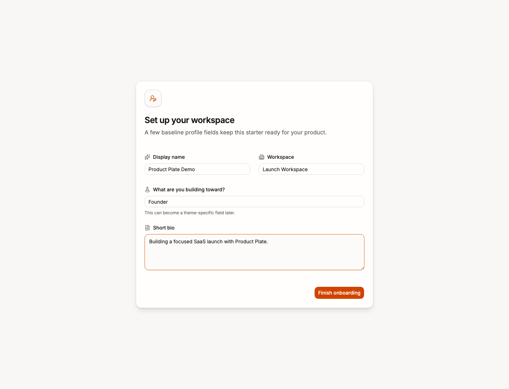
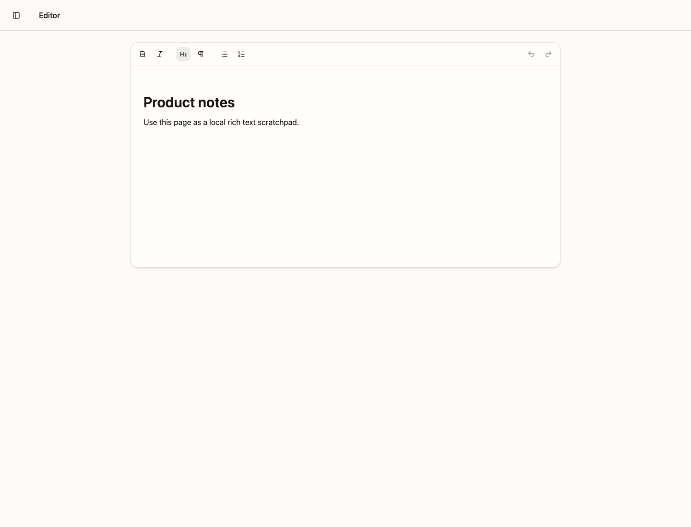

<p align="center">
  
</p>

<h1 align="center">Product Plate</h1>

<p align="center">
  <strong>SvelteKit starter, ready to become your product.</strong>
</p>

<p align="center">
  Auth, billing, realtime data, AI, product UI, tests, and deployment, plus a practical prompt that helps your coding agent turn the starter into a focused product.
</p>

<p align="center">
  <a href="https://productplate.pages.dev/auth/demo">Live demo</a>
  ·
  <a href="./START_HERE.md">Kickstart prompt</a>
  ·
  <a href="https://productplate.pages.dev/components">Component gallery</a>
  ·
  <a href="./LICENSE">MIT license</a>
</p>

## Why this exists

Most starters save setup time, then leave you with a permanent showcase app.

Product Plate gives you two things:

- A working SvelteKit product foundation with connected routes and integrations.
- [`START_HERE.md`](./START_HERE.md), a guided prompt that tells your coding agent how to keep what fits, remove what does not, rename the product, update the docs, and verify the result.

The goal is a smaller first version of your product, not a renamed template.

## See the product

The hosted demo creates a fresh disposable account and opens the authenticated app:

- [Open the live demo](https://productplate.pages.dev/auth/demo)

<p align="center">
  
</p>

<p align="center">
  
  
</p>

## What is wired

- **App:** SvelteKit 2, Svelte 5, TypeScript, Tailwind CSS v4, shadcn-svelte.
- **Backend:** Convex functions, realtime data, storage, and generated types.
- **Accounts:** Better Auth, email/password, Google OAuth wiring, reset flows, protected routes.
- **Billing:** Autumn checkout, subscription state, and customer portal patterns.
- **AI:** Vercel AI SDK route, streaming assistant UI, Markdown, suggestions, and tool calls.
- **Product UI:** onboarding, dashboard, profile, settings, admin, editor, graph, map, 3D, uploads.
- **Delivery:** Bun, Vitest, Playwright, PWA support, GitHub Actions, Cloudflare Pages.

## Start here

```sh
git clone https://github.com/rodrgds/productplate.git my-product
cd my-product
```

Before installing dependencies, open [`START_HERE.md`](./START_HERE.md) in your coding agent. It will:

1. Ask what you are building.
2. Recommend what to keep, reshape, remove, or decide later.
3. Select one active backend, auth, billing, and AI path.
4. Build the smallest coherent product loop.
5. Update identity, routes, docs, tests, and deployment settings.

Then run the selected stack:

```sh
bun install
cp .env.example .env.local
bun convex dev
bun dev
```

Open `http://localhost:5173`.

For local auth, set the same URL in Convex:

```sh
bun convex env set SITE_URL http://localhost:5173
```

## Environment

Minimum local variables:

```env
CONVEX_DEPLOYMENT=
PUBLIC_CONVEX_URL=
PUBLIC_CONVEX_SITE_URL=
SITE_URL=http://localhost:5173
BETTER_AUTH_SECRET=
```

Optional integrations:

```env
GOOGLE_CLIENT_ID=
GOOGLE_CLIENT_SECRET=
RESEND_API_KEY=
OPENROUTER_API_KEY=
AUTUMN_SECRET_KEY=
```

Use [`.env.example`](./.env.example) for local configuration and [`.env.server.example`](./.env.server.example) for production-only secrets.

## Commands

| Command             | Purpose                            |
| ------------------- | ---------------------------------- |
| `bun dev`           | Start SvelteKit                    |
| `bun convex dev`    | Start Convex                       |
| `bun run check`     | Typecheck Svelte and TypeScript    |
| `bun run lint`      | Check formatting and ESLint        |
| `bun run test:unit` | Run Vitest                         |
| `bun run test:e2e`  | Run Playwright                     |
| `bun run build`     | Build for production               |
| `bun run verify`    | Run lint, checks, tests, and build |

## Project map

```text
src/routes/                 Public, auth, API, and product routes
src/routes/(app)/           Authenticated app shell and product examples
src/lib/components/ui/      shadcn-svelte primitives
src/lib/components/ai/      Streaming assistant and tool components
src/lib/components/landing/ Reusable marketing component gallery
static/screenshots/         Product screenshots used by the site and README
src/convex/                 Schema, auth, billing, storage, and functions
_template_options/          Inactive provider and database scaffolds
docs/                       Integration and framework guidance
```

## Deployment

The default production path is Convex plus Cloudflare Pages.

```sh
bun convex deploy
bun run build
```

Cloudflare Pages:

```text
Build command: bun run build
Build output: .svelte-kit/cloudflare
Node.js: 22
```

The included GitHub Actions workflow runs checks and deploys `main` after the required Cloudflare secrets and repository variables are configured.

## License

MIT. Use it for personal, commercial, closed-source, or open-source products.
